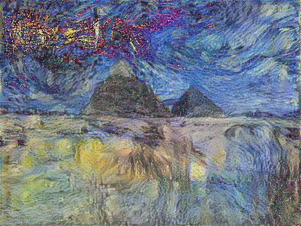
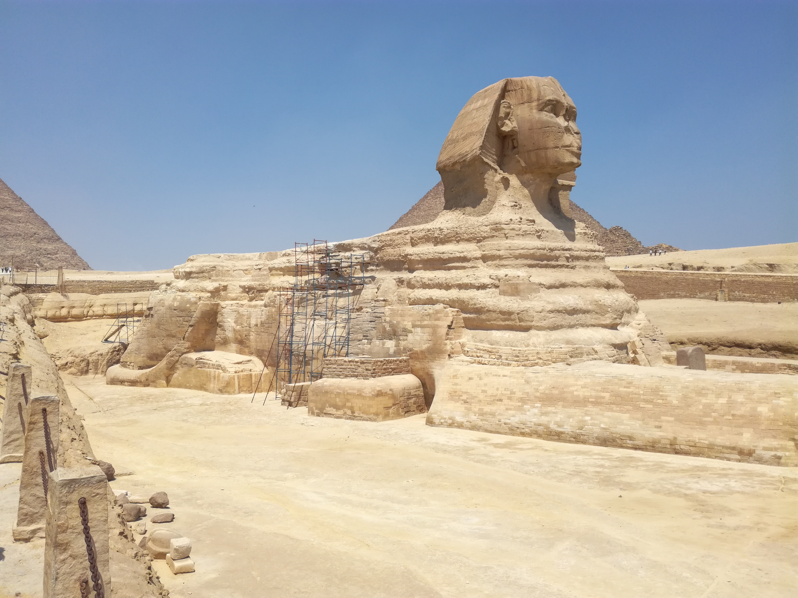
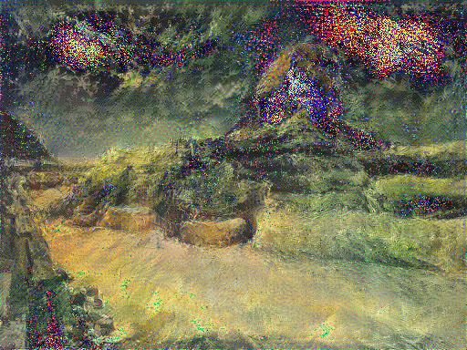

# Paper_Re-Implementation

## Deep Learning

### A Neural Algorithm of Artistic Style (Gatys, L.) - [Paper](https://arxiv.org/pdf/1508.06576.pdf)
Repaint a content image with the style of another image:

 +  = 

 +  = 

Note: Clipping image pixels to 0-1 causes bright red and yellow clusters. Maybe have a look there.
